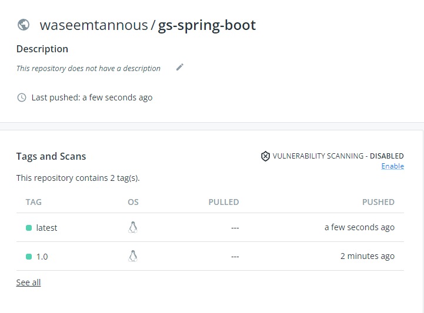

# gs spring boot

In this repository, I have used the https://github.com/spring-guides/gs-spring-boot.git repo to dockerize a spring boot application with multi-stage build.

## Build and Push Container

```sh
git clone https://github.com/waseemtannous/gs-spring-boot.git
cd gs-spring-boot
docker build -t gs-spring-boot .
docker tag gs-spring-boot waseemtannous/gs-spring-boot:latest
docker push waseemtannous/gs-spring-boot:latest
```



## Run Container

To run the container, you can use the following commands:

```sh
git clone https://github.com/waseemtannous/gs-spring-boot.git
cd gs-spring-boot
docker build -t gs-spring-boot .
docker run -d -p 8080:8080 gs-spring-boot
```

Alternatively, you can pull the image from the Docker Hub and run it:

```sh
docker pull waseemtannous/gs-spring-boot
docker run -d -p 8080:8080 waseemtannous/gs-spring-boot
```

Now you can visit the application at http://localhost:8080/
